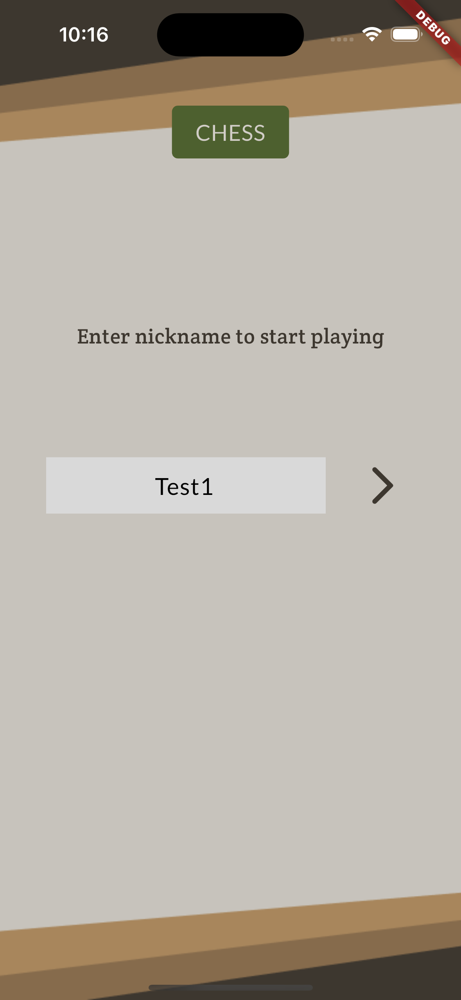
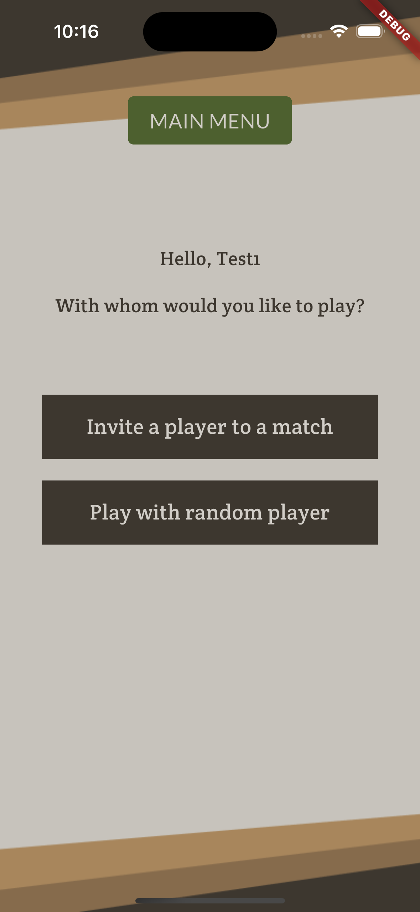
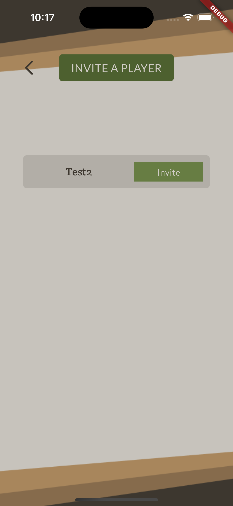
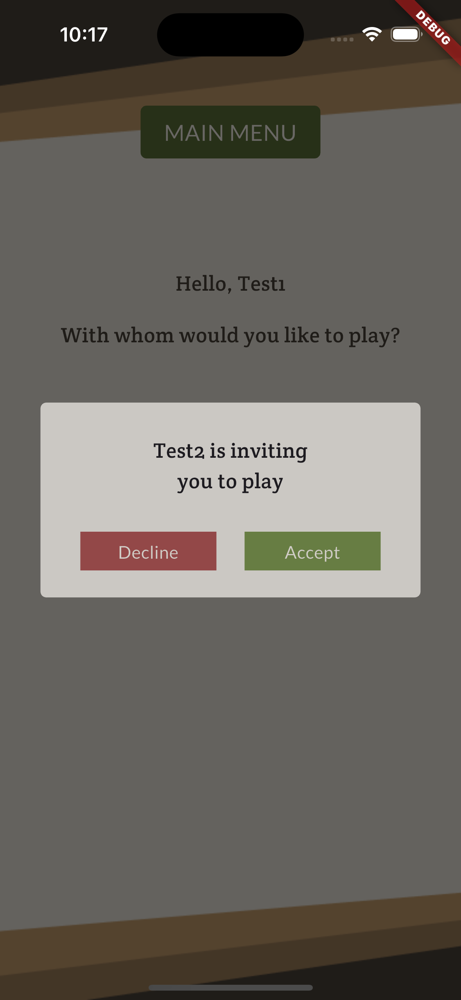
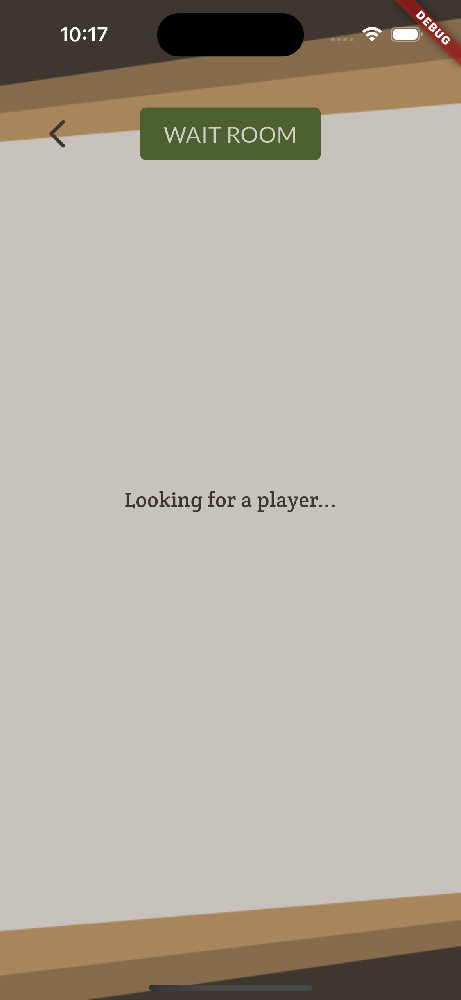
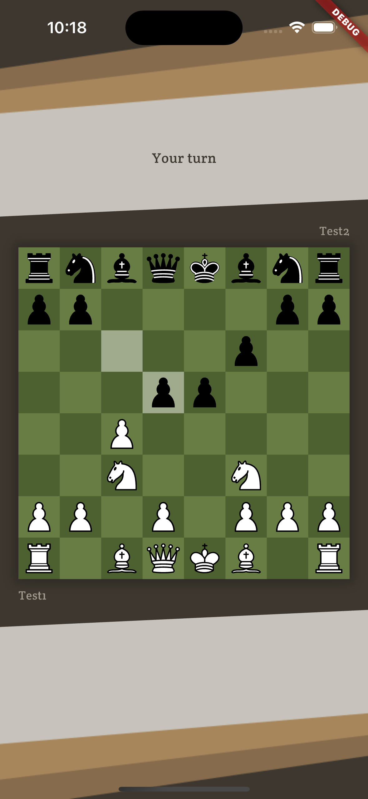
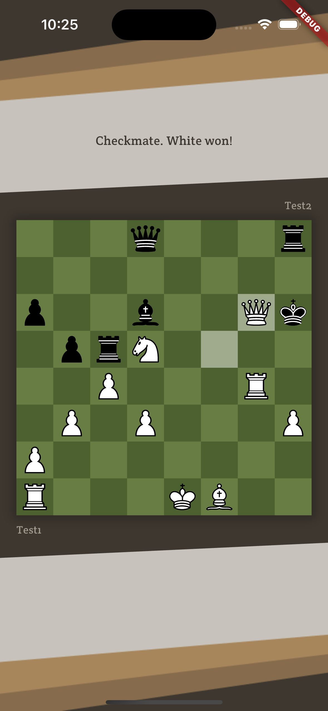

# Chess

## Description

Online chess game where users can invite other players for a match
or join a wait room to start a game with random player.  
Users will also receive a notification if they don't have the app open and the opponent has made their move.

## Author

Erik Hans Sepp (ehspp)

## Technologies used

Frontend:

- Flutter
- Dart
- Provider

Backend:

- Go
- Chess package (https://github.com/notnil/chess)

Other:

- Websocket

## Usage

### Frontend:

To run locally you need to have Flutter installed and first install dependencies, while in frontend folder:  
`flutter pub get`

Then you can run the app:  
`flutter run`

### Backend:

In backend folder:  
`go run .`

## Screenshots

 
 
 
 
 
 
 
